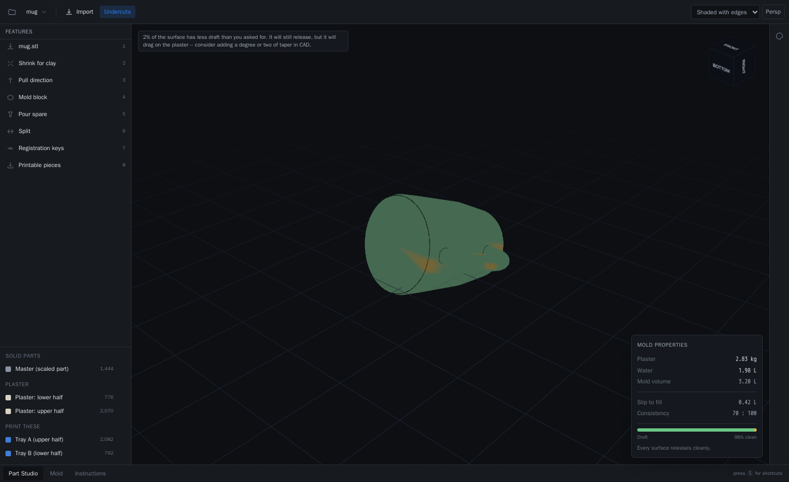
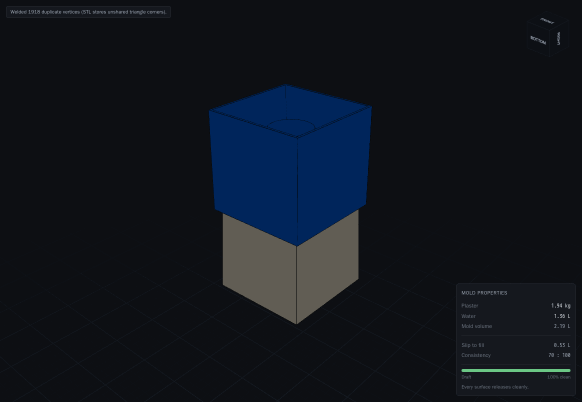
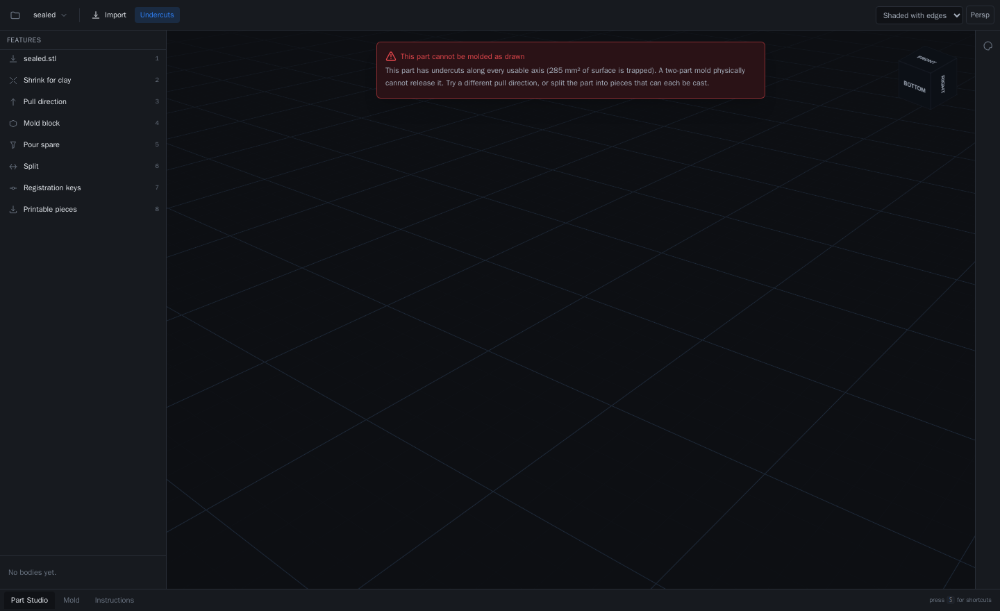
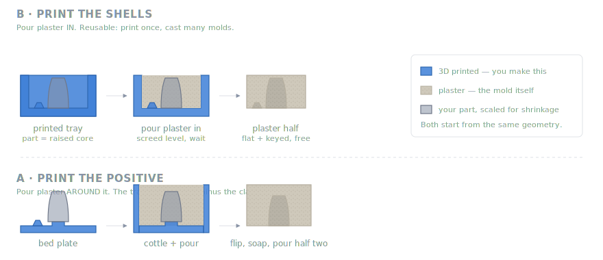
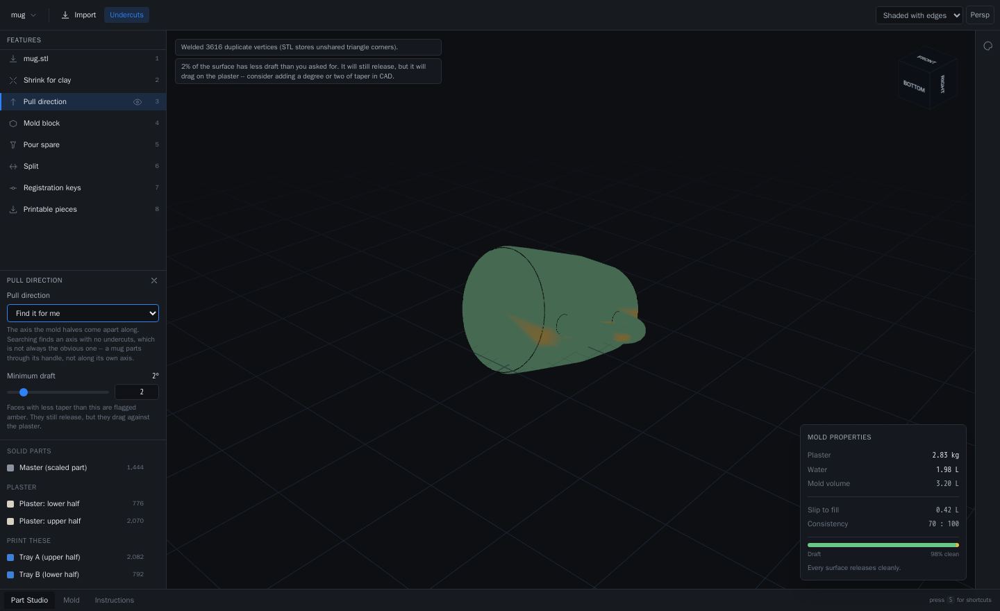
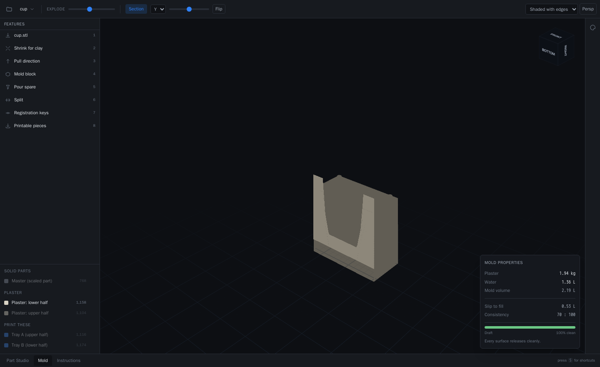
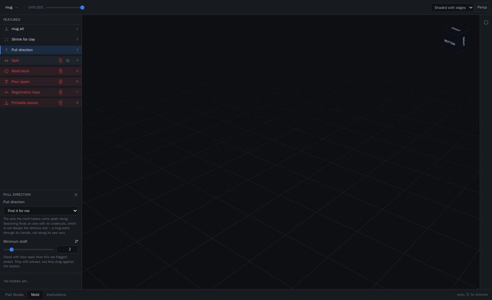

<div align="center">

# SlipCast

**Upload a solid model. Get a printable plaster slip-casting mold.**

Runs entirely in your browser. Nothing is uploaded, nothing is stored, there is no server.

[**Open the app →**](https://10cdizzle.github.io/SlipCasting-Site/) &nbsp;·&nbsp; [Docs](docs/index.md) &nbsp;·&nbsp; [Slip casting primer](docs/slip-casting-primer.md)

</div>

---



Design the pot. Skip the mold.

SlipCast takes an STL, OBJ, 3MF or STEP file and produces the geometry you need to make
a plaster mold for it: scaled for clay shrinkage, split along an axis that will actually
come apart, keyed so the halves seat identically, with a pour spare — and a recipe
telling you how many kilograms of plaster to weigh out.

<div align="center">



</div>

## What makes it more than a boolean

**It finds the seam a potter would use.** A mug is a hopeless undercut along its own
axis — the inside of the handle is hidden from both above and below. Part it
*perpendicular to the handle's loop*, pulling straight through the hole, and every
surface is reachable. That is exactly where a pottery puts the seam on a mug mold, and
SlipCast finds it by searching for an axis with no undercuts rather than assuming the
obvious one.

**It knows when to say no.** Some parts cannot be molded — an enclosed void cannot be
reached from any direction. SlipCast refuses, and says why. A tool that quietly emits
geometry for an impossible part is worse than one that emits nothing, because the failure
only surfaces after someone has printed it, poured it, and waited an hour.



**It gets the shrinkage arithmetic right.** 13% shrinkage is a **1.149×** mold, not
1.13×. The wrong one gives you pots that are quietly a size too small, and you find out
after the kiln.

**It gives you the recipe, not just the geometry.** Plaster is mixed by weight to a
consistency. Mixed by eye you get a mold too dense to absorb water — and absorbency is
the entire mechanism, so it simply will not cast.

## The two workflows



**Print the shells** — pour plaster *into* printed trays. Both halves cast parting-face
down against a flat printed floor, so that face comes out flat and already keyed with no
hand work. Print once, cast as many plaster molds as you like.

**Print the positive** — pour plaster *around* the printed part. The traditional route,
with the worst step removed: a printed bed plate replaces bedding the model in clay by
hand.

Full instructions for both in [docs/workflows.md](docs/workflows.md).

## The parametric workspace

The UI is modelled on Onshape. It is a real feature tree, not a wizard.

|  |  |
|---|---|
|  | **The undercut heatmap.** Green releases cleanly, amber drags against the plaster, red is trapped and cannot be molded at all. |
|  | **Section any half open** to see the cavity and the plaster around it. The cut face is capped, so it reads as solid plaster rather than a hollow shell — and the registration keys are right there on the parting face. |
|  | **Drag a feature somewhere illegal and it goes red**, telling you what it needed — rather than refusing the gesture. The same thing Onshape does. |

There is a Rollback Bar that regenerates the model at any earlier point in its history, a
branching version graph with a real three-way merge, and a Configuration panel that emits
one mold per clay shrinkage in a single pass.

Onshape's Mass Properties corner is translated into the plaster and slip calculator —
because mass is not the number you need at a plaster bench.

## Quick start

Just [open the app](https://10cdizzle.github.io/SlipCasting-Site/). There is nothing to
install and nothing to sign up for.

To run it locally — **everything is in Docker; nothing touches your machine:**

```bash
docker compose run --rm dev npm install
docker compose up dev                 # http://localhost:5173
```

Or headlessly, from a terminal:

```bash
docker compose run --rm dev npm run cli -- part.stl --mode shells -o ./out
```

```
Generating a shells mold from part.stl...

  Pull direction   0.00, 0.00, 1.00
  Plaster          1.99 L
  Pieces to print  2

Wrote ./out/slipcast-mold.zip
```

## Tests

```bash
docker compose -f docker-compose.test.yml run --rm test   # 109 geometry tests
docker compose -f docker-compose.test.yml run --rm e2e    # the real app, headless Chromium
```

The geometry is the risky part, so it is tested hardest. The load-bearing assertion:

```
vol(upper) + vol(lower) + vol(block ∩ cavity) == vol(block)
```

Plaster, plus the space the part occupies, equals the block it was cut from. Nothing
vanishes and nothing is created. Almost every way a boolean pipeline can be wrong — an
inverted operand, a missed intersection, a solid silently emptied — violates that one
line.

The screenshots above are captured by driving the real app in a headless browser, so they
cannot show a workflow that does not work.

## How it works

The whole geometry engine is TypeScript and WASM running in your browser:
[`manifold-3d`](https://github.com/elalish/manifold) for the booleans,
[`three-mesh-bvh`](https://github.com/gkjohnson/three-mesh-bvh) for the ray casting that
finds undercuts, and OpenCascade for STEP — lazily loaded, so you only pay for it if you
use it.

Manifold's WASM is single-threaded, which is exactly what makes free static hosting
possible: threaded WASM needs `SharedArrayBuffer`, which needs COOP/COEP headers, which
GitHub Pages cannot set.

See [docs/architecture.md](docs/architecture.md) and
[docs/geometry-pipeline.md](docs/geometry-pipeline.md).

## What it deliberately does not do

Planar parting surfaces only, two pieces at most, and no automatic undercut removal — if
your part cannot be molded, it tells you rather than silently reshaping your design. The
full list is in [docs/roadmap.md](docs/roadmap.md).

## Licence

MIT.
